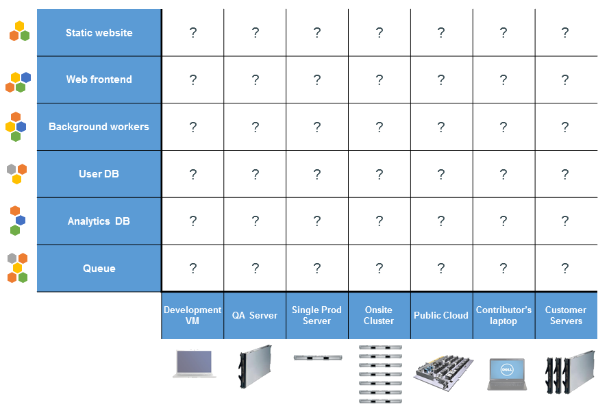
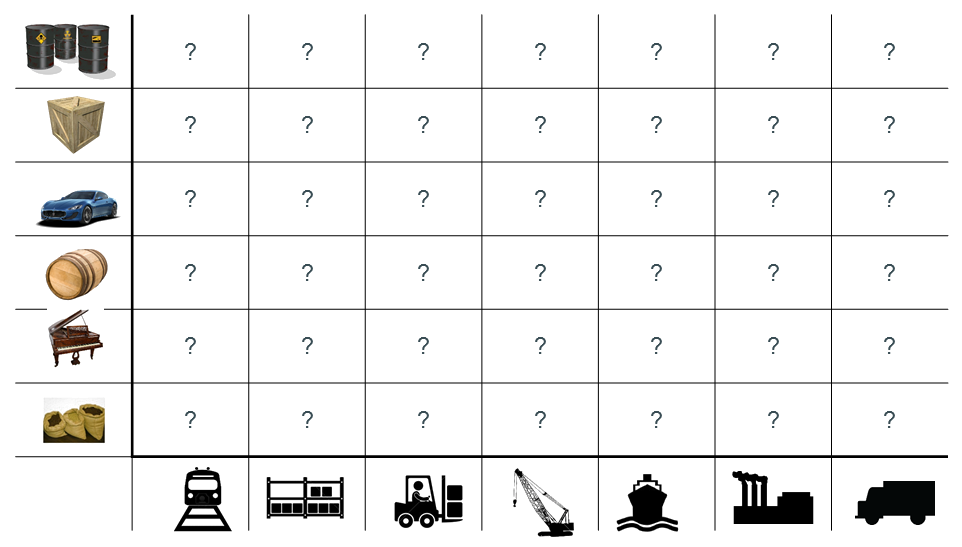
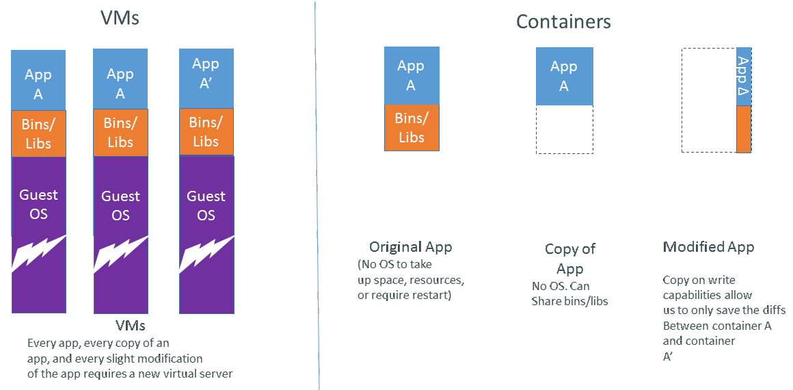

---?image=assets/cover.png&size=contain
 
## Orchestration Wars
 
### Docker Swarm vs Kubertes
#### Tomé Vardasca
 
###### tome@vardas.ca / @tomvardasca

---

## Let's Start
 

 * **Who uses Docker/Containers daily?**
 * **In Production?**
 * **Who already used an orchestrator?**
 * **configured in Production?**

---

#### Why Containers? The Challenge
 

---

#### The Matrix from Hell

---

#### Cargo Transport Pre-1960

---

#### Also a Matrix from Hell

---

#### Solution: Intermodal Shipping Container

---

#### Docker is a Container System for Code

---

#### Docker Eliminates the Matrix from Hell

---

#### Why containers - Developers
 
Build once and run anywhere:
* A clean, safe, hygienic, portable runtime environment for your app.
* No worries about missing dependencies, packages and other pain points during subsequent deployments.
* Run each app in its own isolated container, so you can run various versions of libraries and other dependencies for each app without worrying.
---

#### Why containers - Developers (cont.)
 
Build once and run anywhere:

* Automate testing, integration, packaging...anything you can script.
* Reduce/eliminate concerns about compatibility on different platforms, either your own or your customers.
* Cheap, zero-penalty containers to deploy services. A VM without the overhead of a VM. Instant replay and reset of image snapshots.

---

#### Why containers - Administrator/Operations
 
Configure once... run anything
* Make the entire lifecycle more efficient, consistent, and repeatable
* Increase the quality of code produced by developers.
* Eliminate inconsistencies between development, test, production, and customer environments.

---

#### Why containers - Administrator/Operations (cont.)
 
Configure once... run anything
* Support segregation of duties.
* Significantly improves the speed and reliability of continuous deployment and continuous integration systems.
* Because the containers are so lightweight, address significant performance, costs, deployment, and portability issues normally associated with VMs.

---

#### VMs vs Containers

---

#### Why are Docker Containers Lightweight?

---

#### Orchestration?
 
  * you can start containers manually
    * what you do when it crashes?
    * what about scale?
    * ...and resource optimization?

---

#### Enter container orchestration

... at a hight level provide you:
 * failover
 * scheduling
 * resource optimization
 * load balancing
 * service discovery

---

#### Enter container orchestration (cont.)

 * storage
 * secret management
 * logs
 * health checks
 * metrics

---

#### Most Popular
 

##### Kubernetes
##### Docker Swarm

---

#### Most Popular - Kubernetes
 * Originally developed at Google Inc., inspered by 10+ years of expirence in Borg and Omega;
 * Fully open-source, and managed by Cloud Native Computing Foundation;
 * Initial release in 2014.

---

#### Most Popular Swarm
 * Developed by Docker Inc. as a native container orchestrator for Docker engine (the most used container format and runtime);
 * Fully open-source at Swarm Docker repo;
 * Initial release in 2015, major refactor in 2016, included in Docker engine in the end of 2016/start of 2017 - as Swarm Mode.

---

#### Kubernetes vs Swarm

---

#### Kubernetes vs Swarm

---

#### Swarm concepts
 * Containers
 * Nodes:
    * Managers
    * Workers
 * Networks
    * Ingress outside access
 * Secret management

---

#### Swarm concepts
 * Services
    * Replication modes:
      * global
      * replication
    * Load balancing between containes
    * Update policy (rollback on failure)
    * Restart policy (restart on failure)
    * Limits policy (RAM and CPU - hard and soft)

---

#### Swarm Pros

 * Native orchestration shipped with Docker 
 * Quickest ramp-up
 * All-in, no external dependencies
 * Secure by default (automatic TLS keying and signing)
 * Declarative service model
 * Desired state reconciliation
 * Placement with labels and constraints

---

#### Swarm Pros

 * Overlay networks provide isolation
 * Service Discovery through DNS
 * Load Balancing
 * Rolling Upgrades
 * Persistent storage
 * Secret management and encrypted at rest

---

#### Swarm Cons

 * Not for complicated large scale app
 * No RBAC
 * No UI (available in commercial Docker DataCenter)
 * No specific multi-datacenter support
 * Not that battle tested

---

#### Swarm

### DEMO

---

#### Swarm demo recap

---?code=docker-compose.yml

@[4-8] (Swarm demo recap - Container config and image name)
@[10-11] (Swarm demo recap - Deployment mode)
@[12-20] (Swarm demo recap - Resource management)
@[28-33] (Swarm demo recap - Update policy)

---

#### K8s concepts

 * Pods
   * ephmeral like containers
   * can have more than one container
   * all share the same network resources
 * Deployments
   * provide controlled deployment and updates - Rolling Updates
 * Replica Sets
   * Statless deploy replicas

---

#### K8s concepts

 * Statefull Sets
   * replicas with associated storage
 * Daemon Sets
   * deploy on all nodes
 * Jobs
   * like cron 
 * Storage
 * Secret management

---

#### K8s concepts

 * Services
   * for discovery and loadbalancing
 * Ingress
   * for external access
 * Configuration Objects
 * RBAC
 * Namespaces
 * Auto Node Scaling
 * Auto Horizontal Scaling

---

#### K8s Pros
 
 * More feature rich and mature 
 * Nice POD workload definition 
 * Stateful sets to support stateful apps 
 * Build from the years of experience inside Google
 * Strong support from Google and RedHat

---

#### K8s Pros

 * No vendor lock-in 
   * support other container formats/runtimes besides docker
 * Strong community 
 * Tested with thousands nodes 
 * UI and CLI (kubectl) 
 * RBAC support through Namespaces 
 * Support for multi datacenters through Federation

---

#### K8s Cons

* More complex (etcd, API server, scheduler, kubelet, kubeproxy, ...)
* No network overlay by default (but easily installable throught pod networks)
* No direct interaction with the docker daemon
* Opinionated piece of software
* Not secure by default, you have to configure your own TLS infrastructure

---

#### K8s demo recap

---?code=kubernetes/deployment.yml

@[17-23] (K8s demo recap - Container config and image name)
@[8] (K8s demo recap - Deployment mode)
@[24-30] (K8s demo recap - Resource management)
@[10-15] (K8s demo recap - Update policy)

---

#### K8s and Swarm

* Easy to relate some concepts
  * Swarm abstracts the K8s Services/Deployments/ReplicaSets in the Service concept

---

#### K8s vs. Swarm recap

* Swarm is easier at first, but not much battle tested
* K8s much more tested and without vendor lock-in
* K8s capabilities with RBAC makes it more enterprise grade ( Docker EE also suports it)
* K8s multi-cloud deployment is the most resilient setup

---

#### Useful links

 * [Play With Docker](http://labs.play-with-docker.com/)
   * Play not only with Docker but also create your own Swarm
 * [Minikube](https://github.com/kubernetes/minikube)
   * For testing Kubernetes localy

Some contents of the the slides have been borrowed from [Docker Slideshare](http://www.slideshare.net/dotCloud) materials.

---

## Questions?

### Thank you

###### @tomvardasca
###### github.com/tomvardasca
###### tome@vardas.ca

---
